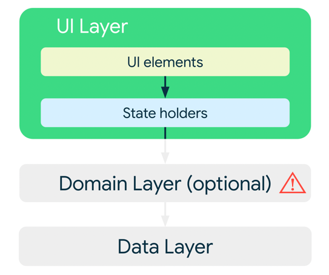
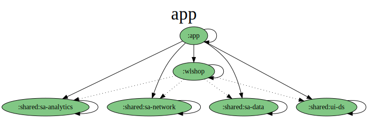

## Tech stack used to built

- [Kotlin](https://kotlinlang.org/), [Coroutines](https://github.com/Kotlin/kotlinx.coroutines) and [StateFlow & SharedFlow](https://developer.android.com/kotlin/flow/stateflow-and-sharedflow)
- [Navigation Component](https://developer.android.com/guide/navigation) - Single Host Activity with some multiple fragments approach
- [JetPack](https://developer.android.com/jetpack)
    - [LiveData](https://developer.android.com/topic/libraries/architecture/livedata) - Observable lists.
    - [Lifecycle](https://developer.android.com/topic/libraries/architecture/lifecycle) - Dispose of observing data when lifecycle state changes.
    - [Fragment-ktx](https://developer.android.com/kotlin/ktx#fragment) - A set of Kotlin extensions that helps with fragment lifecycle.
    - [ViewModel](https://developer.android.com/topic/libraries/architecture/viewmodel) - UI related data holder, lifecycle aware.
- [Manual Dependency Injection](https://developer.android.com/training/dependency-injection/manual) using simple hand-on dependency injection.
- [Room](https://developer.android.com/training/data-storage/room) The Room persistence library provides an abstraction layer over SQLite to allow fluent database access while harnessing the full power of SQLite.
- [OKHttp3](https://square.github.io/okhttp/) HTTP client builder for Android.
- [Coil](https://coil-kt.github.io/coil/) - Coil is an image loading library for Android backed by Kotlin Coroutines.
- [Kotlin-Kover](https://github.com/Kotlin/kotlinx-kover) - Kover is a set of solutions for collecting test coverage of Kotlin code compiled for JVM and Android platforms.

## Tests
- [Mockk](https://mockk.io/) library
- JUnit4
- ActivityScenarios
- Espresso

## Architecture
For this app was uses [***MVVM (Model View View-Model)***](https://developer.android.com/jetpack/docs/guide#recommended-app-arch) architecture



## API Service 🔑

- [Fake Store API](https://fakestoreapi.com) It was fakeStoreApi is a free online REST API that you can use whenever you need Pseudo-real data for your e-commerce or shopping website without running any server-side code. It's awesome for teaching purposes, sample codes, tests, etc.


## Modularization



### WLShop was built segregate in some modules, like
------------------------------------------------------------
Root project 'WLShop' project's view
------------------------------------------------------------
```kotlin
Root project 'WLShop'
+--- Project ':app' ---> Main Application of our App
+--- Project ':shared' ---> Shared library to be consumed for ours libraries.
|    +--- Project ':shared:sa-analytics' ---> Responsible by share our tracking logic between modules 
|    +--- Project ':shared:sa-data' ---> Responsible by share our persistence logic between modules
|    +--- Project ':shared:sa-network' ---> Responsible by share our made network logic between modules
|    \--- Project ':shared:ui-ds' ---> Responsible by share our base tokens and themes design system between modules
\--- Project ':wlshop' ---> White label library of the e-commerce  

Included builds
\--- Included build ':build-source' ---> Source build system logic used to share common config between android libraries.
```

## Licence

```
    Designed and developed by 2024 recepbrk (Recep Güzel)

   Licensed under the Apache License, Version 2.0 (the "License");
   you may not use this file except in compliance with the License.
   You may obtain a copy of the License at

     http://www.apache.org/licenses/LICENSE-2.0

   Unless required by applicable law or agreed to in writing, software
   distributed under the License is distributed on an "AS IS" BASIS,
   WITHOUT WARRANTIES OR CONDITIONS OF ANY KIND, either express or implied.
   See the License for the specific language governing permissions and
   limitations under the License.
```